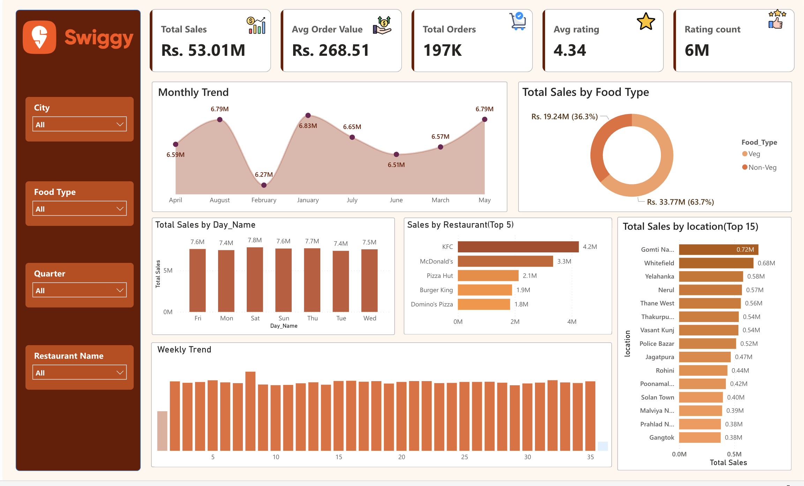

# Swiggy Sales Dashboard (Power BI)

**1. Project Title :** _Swiggy Sales Performance Analysis Dashboard_

An interactive Power BI report designed to analyze Swiggy sales performance, track order trends, compare restaurant sales, and understand sales distribution across food types, locations, and time periods.

**2. Purpose:**

- The Swiggy Sales Dashboard provides visual insights into total sales, total orders, average order value, ratings, restaurant-wise sales, and location-wise performance.
- It helps analyze monthly trends, weekly sales patterns, day-wise sales, top restaurants, and Veg vs Non-Veg sales contribution.

**3. Tech Stack:**

The dashboard was built using the following tools and technologies:

- Power BI Desktop : Main platform for dashboard development

- Power Query : Data cleaning, transformation & preparation

- DAX (Data Analysis Expressions) : Used for KPIs and calculated measures

- Data Modeling : Fact and dimension tables connected for analysis

- SQL : Used for data validation, transformation, and feature creation

- File Formats : .pbix for development, .csv for dataset, .png for dashboard preview

**4. Data Source:**

Swiggy Food Delivery Dataset

The dataset consists of:

Fact Orders – Sales, Orders, Rating, Date Key, Dish Key, Restaurant Key, Location Key

Dim Restaurant – Restaurant name and restaurant details

Dim Location – City and location information

Dim Dish – Dish name and food type

Dim Date – Date, month, week, quarter, and day details

**5. Features:**

**Business Problem:**

Food delivery businesses need to analyze sales and order data to quickly answer:

1. What is the overall sales and order performance?

2. Which restaurants generate the highest sales?

3. Which locations contribute the most sales?

4. How are sales distributed between Veg and Non-Veg food?

5. How do sales vary by month, week, and day?

**Goal of the Dashboard:**

To create a single-screen analytical dashboard that:

- Tracks total sales, total orders, and average order value
- Monitors average rating and total rating count
- Highlights top-performing restaurants by sales
- Shows location-wise sales contribution
- Compares Veg and Non-Veg sales distribution
- Analyzes monthly, weekly, and day-wise sales trends

**Walkthrough of Key Visuals:**

**i) KPI Tiles (Top Panel)**

- Total Sales

- Avg Order Value

- Total Orders

- Avg Rating

- Rating Count

These KPIs update dynamically based on slicer selections.

**ii) Monthly Trend:**

Shows monthly sales movement and helps identify high and low sales months.

**iii) Total Sales by Food Type:**

Compares Veg and Non-Veg sales contribution in the overall sales.

**iv) Total Sales by Day Name:**

Shows sales distribution across different days of the week.

**v) Sales by Restaurant (Top 5):**

Displays the top 5 restaurants based on total sales.

**vi) Total Sales by Location (Top 15):**

Shows the top 15 locations contributing to total sales.

**vii) Weekly Trend:**

Tracks sales performance across weeks and helps observe short-term sales movement.

**Business Impact & Insights**

1. Sales Monitoring: Track overall sales, orders, and average order value

2. Restaurant Performance: Identify top restaurants based on sales

3. Location Analysis: Find locations contributing higher sales

4. Food Type Analysis: Compare Veg and Non-Veg sales contribution

5. Trend Analysis: Understand monthly, weekly, and day-wise sales patterns

**6. Screenshot:**

